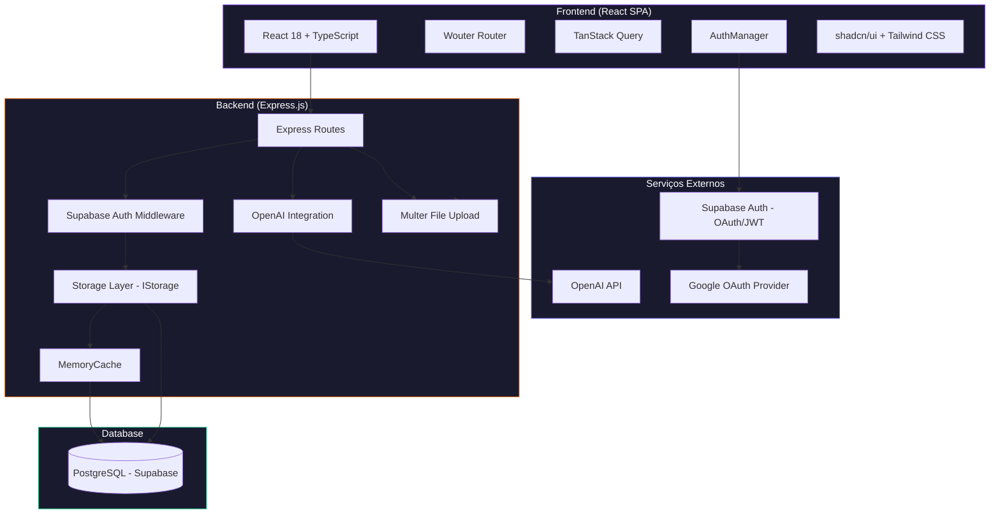

# ARCHITECTURE.md — Symera

## Diagrama Geral do Sistema

## Stack Tecnológica

### Frontend
| Tecnologia | Versão | Propósito |
|-----------|--------|-----------|
| React | 18.3.x | UI framework |
| TypeScript | 5.6.x | Type safety |
| Vite | 5.4.x | Build tool e dev server |
| Wouter | 3.3.x | Roteamento client-side (leve, ~1.5KB) |
| TanStack Query | 5.60.x | Server state management, caching, refetch |
| React Hook Form + Zod | 7.55.x / 3.24.x | Formulários com validação schema-first |
| Tailwind CSS | 3.4.x | Utility-first CSS |
| shadcn/ui + Radix | Múltiplos | Component library (acessível, customizável) |
| Framer Motion | 11.13.x | Animações declarativas |
| Recharts | 2.15.x | Gráficos e visualizações |
| Lucide React | 0.453.x | Ícones |

### Backend
| Tecnologia | Versão | Propósito |
|-----------|--------|-----------|
| Express.js | 4.21.x | Servidor HTTP |
| Drizzle ORM | 0.39.x | ORM type-safe para PostgreSQL |
| Neon Serverless | 0.10.x | Driver PostgreSQL com WebSocket |
| Supabase JS | 2.90.x | Auth client (JWT) |
| Multer | 2.0.x | Upload de arquivos |
| OpenAI SDK | 4.98.x | Integração com GPT |
| Express Session + MemoryStore | — | Sessões |
| Zod | 3.24.x | Validação server-side |

### Infra & Tooling
| Tecnologia | Propósito |
|-----------|-----------|
| PostgreSQL (Supabase) | Banco de dados relacional |
| Supabase Auth | OAuth (Google) + JWT tokens |
| Vercel | Hosting frontend + serverless API |
| Drizzle Kit | Migrações de banco de dados |
| esbuild | Bundle do servidor para produção |
| tsx | Runtime TypeScript para desenvolvimento |
| cross-env | Variáveis de ambiente cross-platform |

## Padrões Arquiteturais Adotados

### 1. Monolito Modular (fullstack)
O projeto é um **monolito** com frontend e backend no mesmo repositório. Em desenvolvimento, o Vite serve o frontend como middleware do Express. Em produção, o frontend é pré-compilado e servido como arquivos estáticos.

### 2. Camada de Storage (Repository Pattern)
A interface `IStorage` define todas as operações de dados, implementada por `DatabaseStorage`. Isso:
- Centraliza toda a lógica de acesso a dados.
- Facilita testes com implementações mock.
- Isola o Drizzle ORM das rotas.

### 3. Server State via TanStack Query
O frontend não usa estado global (Redux/Zustand). Todo estado vindo do servidor é gerenciado pelo TanStack Query com:
- Cache automático por query key.
- Invalidação seletiva via `queryClient.invalidateQueries()`.
- Retry automático com backoff exponencial.

### 4. Schema-First Validation
O Drizzle ORM gera tipos TypeScript do schema. O `drizzle-zod` cria schemas de validação Zod a partir das tabelas. Os mesmos schemas são usados no frontend (formulários) e backend (validação de request).

### 5. Auth via JWT Stateless
O backend **não** mantém sessões de autenticação ativas. Cada request contém o JWT do Supabase no header `Authorization: Bearer <token>`. O middleware decodifica e resolve o ID efetivo do usuário.

## Decisões Arquiteturais (ADR)

### ADR-001: Wouter em vez de React Router
**Decisão**: Usar Wouter para roteamento.
**Justificativa**: Wouter é ~1.5KB vs ~14KB do React Router. Para uma SPA mobile-first, menor bundle = melhor performance.
**Trade-off**: Menos funcionalidades (sem data loaders, sem nested routes nativas).

### ADR-002: Neon Serverless Driver
**Decisão**: Usar `@neondatabase/serverless` como driver PostgreSQL.
**Justificativa**: Compatível com o modelo serverless da Vercel, usando WebSockets para conexões performáticas. Pool configurado com max 10 conexões, retry automático para rate limits.

### ADR-003: MemoryCache no Storage
**Decisão**: Cache em memória no backend com TTLs por tipo de dado.
**Justificativa**: Reduzir queries ao banco para dados frequentemente acessados. TTLs: Users 5min, Events 3min, Tasks 2min. Trade-off: dados podem estar levemente desatualizados.

### ADR-004: Resolução de ID por Email
**Decisão**: Ao autenticar, priorizar o ID existente no banco pelo email, não o UUID do Supabase.
**Justificativa**: Migração de sistema de auth legado (Replit) para Supabase. Garantir que dados antigos continuem associados ao mesmo usuário.

### ADR-005: Checklist IA sem OpenAI real
**Decisão**: A função `generateEventChecklist` usa lógica customizada baseada em regras, não a API da OpenAI.
**Justificativa**: Confiabilidade: o sistema não depende de serviço externo para funcionalidade core. A API OpenAI é opcional.

### ADR-006: Imagens como Base64 → Arquivo
**Decisão**: O frontend envia imagens como base64 no JSON. O backend converte para arquivo em `public/uploads/`.
**Justificativa**: Simplifica o fluxo do formulário (sem upload separado), mas **não escalável** em serverless (filesystem efêmero na Vercel).

## Dependências Externas

| Serviço | Criticidade | Fallback |
|---------|-------------|----------|
| **Supabase Auth** | Alta | Tokens salvos no localStorage permitem uso offline temporário |
| **Supabase PostgreSQL** | Crítica | Retry automático com backoff exponencial (3 tentativas) |
| **Google OAuth** | Média | Dev token disponível em desenvolvimento |
| **OpenAI API** | Baixa | Checklist gerado por regras internas; não depende da API |

## Estratégia de Escalabilidade

### Atual (MVP)
- **Vertical**: Servidor monolítico, pool de 10 conexões.
- **Cache**: MemoryCache in-process (não distribuído).
- **Storage**: Filesystem local para uploads.

### Futuro (Recomendado)
1. **Uploads → Supabase Storage ou S3**: Eliminar dependência de filesystem local.
2. **Cache → Redis**: Cache distribuído para múltiplas instâncias.
3. **Separação frontend/backend**: Frontend na Vercel (estático), backend no Railway/Fly.io (persistente).
4. **WebSocket para real-time**: Já possui `ws` como dependência; habilitar notificações em tempo real.

## Estratégia de Observabilidade

### Atual
- **Logs**: `console.log` estruturado com prefixos (`[Auth]`, `[Draft]`, `[AI Checklist]`, `[Debug API]`).
- **Middleware de request logging**: Toda requisição `/api/*` é logada com método, path, status code e duração.
- **Response interceptor**: Respostas JSON são capturadas e logadas (truncadas em 80 caracteres).

### Futuro (Recomendado)
- Ver `OBSERVABILITY.md` para plano completo.

---

*Última atualização: 12/02/2026*
