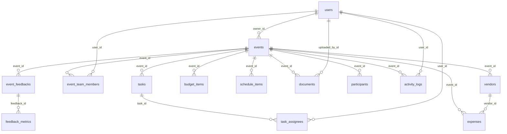

# DATABASE_SCHEMA.md — Symera

## Visão Geral

| Tabela | Descrição | FK Principal |
|--------|-----------|-------------|
| `users` | Usuários do sistema | — |
| `events` | Eventos gerenciados | `users.id` |
| `tasks` | Tarefas dos eventos | `events.id` |
| `task_assignees` | Responsáveis por tarefas | `tasks.id`, `users.id` |
| `event_team_members` | Membros da equipe do evento | `events.id`, `users.id` |
| `vendors` | Fornecedores dos eventos | `events.id` |
| `budget_items` | Itens planejados do orçamento | `events.id` |
| `expenses` | Despesas reais dos eventos | `events.id`, `vendors.id` |
| `schedule_items` | Itens do cronograma | `events.id` |
| `documents` | Documentos anexados | `events.id`, `users.id` |
| `participants` | Participantes/convidados | `events.id` |
| `activity_logs` | Logs de atividade | `events.id`, `users.id` |
| `event_feedbacks` | Feedbacks recebidos | `events.id` |
| `feedback_metrics` | Métricas de feedback | `event_feedbacks.feedbackId` |

## Estrutura de Tabelas

### `users`
```sql
CREATE TABLE users (
  id          TEXT PRIMARY KEY,              -- UUID ou ID legado
  email       TEXT NOT NULL UNIQUE,
  first_name  TEXT NOT NULL,
  last_name   TEXT NOT NULL,
  phone       TEXT,
  profile_image_url TEXT,
  created_at  TIMESTAMP NOT NULL DEFAULT NOW(),
  updated_at  TIMESTAMP NOT NULL DEFAULT NOW()
);
```

### `events`
```sql
CREATE TABLE events (
  id              SERIAL PRIMARY KEY,
  name            TEXT NOT NULL,
  type            TEXT NOT NULL,                -- 'casamento', 'corporativo', etc.
  format          TEXT NOT NULL,                -- 'presencial', 'online', 'hibrido'
  start_date      TIMESTAMP NOT NULL,
  end_date        TIMESTAMP,
  start_time      TEXT,                         -- '09:00'
  end_time        TEXT,                         -- '18:00'
  location        TEXT,
  meeting_url     TEXT,
  description     TEXT,
  budget          INTEGER,                      -- em centavos
  expenses        INTEGER DEFAULT 0,            -- total gasto acumulado
  attendees       INTEGER,
  cover_image_url TEXT,
  status          TEXT DEFAULT 'planning',       -- enum via código
  feedback_url    TEXT,                          -- ID público para feedback
  owner_id        TEXT NOT NULL REFERENCES users(id),
  created_at      TIMESTAMP NOT NULL DEFAULT NOW(),
  updated_at      TIMESTAMP NOT NULL DEFAULT NOW()
);
```

### `tasks`
```sql
CREATE TABLE tasks (
  id          SERIAL PRIMARY KEY,
  title       TEXT NOT NULL,
  description TEXT,
  due_date    TIMESTAMP,
  status      TEXT NOT NULL DEFAULT 'todo',     -- 'todo', 'in_progress', 'completed'
  priority    TEXT NOT NULL DEFAULT 'medium',    -- 'low', 'medium', 'high'
  event_id    INTEGER NOT NULL REFERENCES events(id),
  assignee_id TEXT REFERENCES users(id),         -- legado, usar task_assignees
  created_at  TIMESTAMP NOT NULL DEFAULT NOW(),
  updated_at  TIMESTAMP NOT NULL DEFAULT NOW()
);
```

### `task_assignees`
```sql
CREATE TABLE task_assignees (
  id         SERIAL PRIMARY KEY,
  task_id    INTEGER NOT NULL REFERENCES tasks(id),
  user_id    TEXT NOT NULL REFERENCES users(id),
  created_at TIMESTAMP NOT NULL DEFAULT NOW()
);
```

### `event_team_members`
```sql
CREATE TABLE event_team_members (
  id          SERIAL PRIMARY KEY,
  event_id    INTEGER NOT NULL REFERENCES events(id),
  user_id     TEXT NOT NULL REFERENCES users(id),
  role        TEXT NOT NULL,                    -- 'organizer', custom
  permissions TEXT,                             -- JSON string
  created_at  TIMESTAMP NOT NULL DEFAULT NOW()
);
```

### `vendors`
```sql
CREATE TABLE vendors (
  id            SERIAL PRIMARY KEY,
  name          TEXT NOT NULL,
  contact_name  TEXT,
  contact_email TEXT,
  contact_phone TEXT,
  service       TEXT NOT NULL,
  cost          INTEGER,                        -- em centavos
  notes         TEXT,
  event_id      INTEGER NOT NULL REFERENCES events(id),
  created_at    TIMESTAMP NOT NULL DEFAULT NOW(),
  updated_at    TIMESTAMP NOT NULL DEFAULT NOW()
);
```

### `budget_items`
```sql
CREATE TABLE budget_items (
  id         SERIAL PRIMARY KEY,
  event_id   INTEGER NOT NULL REFERENCES events(id),
  name       TEXT NOT NULL,
  amount     INTEGER NOT NULL,                  -- em centavos
  category   TEXT,
  due_date   TIMESTAMP,
  paid       BOOLEAN DEFAULT false,
  notes      TEXT,
  created_at TIMESTAMP NOT NULL DEFAULT NOW(),
  updated_at TIMESTAMP NOT NULL DEFAULT NOW()
);
```

### `expenses`
```sql
CREATE TABLE expenses (
  id           SERIAL PRIMARY KEY,
  event_id     INTEGER NOT NULL REFERENCES events(id),
  name         TEXT NOT NULL,
  amount       INTEGER NOT NULL,                -- em centavos
  category     TEXT,
  due_date     TIMESTAMP,
  payment_date TIMESTAMP,
  paid         BOOLEAN DEFAULT false,
  notes        TEXT,
  vendor_id    INTEGER REFERENCES vendors(id),
  created_at   TIMESTAMP NOT NULL DEFAULT NOW(),
  updated_at   TIMESTAMP NOT NULL DEFAULT NOW()
);
```

### `schedule_items`
```sql
CREATE TABLE schedule_items (
  id           SERIAL PRIMARY KEY,
  event_id     INTEGER NOT NULL REFERENCES events(id),
  title        TEXT NOT NULL,
  description  TEXT,
  event_date   TIMESTAMP,
  start_time   TEXT NOT NULL,
  location     TEXT,
  responsibles TEXT,                            -- texto livre
  created_at   TIMESTAMP NOT NULL DEFAULT NOW(),
  updated_at   TIMESTAMP NOT NULL DEFAULT NOW()
);
```

### `documents`
```sql
CREATE TABLE documents (
  id             SERIAL PRIMARY KEY,
  event_id       INTEGER NOT NULL REFERENCES events(id),
  name           TEXT NOT NULL,
  category       TEXT NOT NULL,
  description    TEXT,
  file_url       TEXT NOT NULL,
  file_type      TEXT NOT NULL,
  uploaded_by_id TEXT NOT NULL REFERENCES users(id),
  uploaded_at    TIMESTAMP NOT NULL DEFAULT NOW(),
  created_at     TIMESTAMP NOT NULL DEFAULT NOW(),
  updated_at     TIMESTAMP NOT NULL DEFAULT NOW()
);
```

### `participants`
```sql
CREATE TABLE participants (
  id         SERIAL PRIMARY KEY,
  event_id   INTEGER NOT NULL REFERENCES events(id),
  name       TEXT NOT NULL,
  email      TEXT,
  phone      TEXT,
  status     TEXT NOT NULL DEFAULT 'pending',   -- 'pending', 'confirmed', 'cancelled'
  origin     TEXT NOT NULL DEFAULT 'manual',    -- 'manual', 'import'
  created_at TIMESTAMP NOT NULL DEFAULT NOW(),
  updated_at TIMESTAMP NOT NULL DEFAULT NOW()
);
```

### `activity_logs`
```sql
CREATE TABLE activity_logs (
  id         SERIAL PRIMARY KEY,
  event_id   INTEGER NOT NULL REFERENCES events(id),
  user_id    TEXT NOT NULL REFERENCES users(id),
  action     TEXT NOT NULL,
  details    TEXT,                              -- JSON string
  created_at TIMESTAMP NOT NULL DEFAULT NOW()
);
```

### `event_feedbacks`
```sql
CREATE TABLE event_feedbacks (
  id          SERIAL PRIMARY KEY,
  event_id    INTEGER NOT NULL REFERENCES events(id),
  feedback_id TEXT NOT NULL UNIQUE,
  name        TEXT,
  email       TEXT,
  rating      INTEGER NOT NULL,
  comment     TEXT NOT NULL,
  is_anonymous BOOLEAN NOT NULL DEFAULT true,
  created_at   TIMESTAMP NOT NULL DEFAULT NOW()
);
```

### `feedback_metrics`
```sql
CREATE TABLE feedback_metrics (
  id           SERIAL PRIMARY KEY,
  feedback_id  TEXT NOT NULL REFERENCES event_feedbacks(feedback_id),
  viewed_at    TIMESTAMP,
  submitted_at TIMESTAMP,
  ip_address   TEXT,
  user_agent   TEXT,
  created_at   TIMESTAMP NOT NULL DEFAULT NOW()
);
```

## Relacionamentos



## Índices

Índices implícitos criados automaticamente:
- **PKs**: Toda `PRIMARY KEY` cria um índice único automaticamente.
- **UNIQUE**: `users.email`, `event_feedbacks.feedback_id`.
- **FKs**: PostgreSQL não cria índices automáticos para FKs, mas o Drizzle pode criar durante push.

### Índices Recomendados (não implementados)
```sql
CREATE INDEX idx_events_owner_id ON events(owner_id);
CREATE INDEX idx_tasks_event_id ON tasks(event_id);
CREATE INDEX idx_task_assignees_task_id ON task_assignees(task_id);
CREATE INDEX idx_team_members_event_id ON event_team_members(event_id);
CREATE INDEX idx_team_members_user_id ON event_team_members(user_id);
CREATE INDEX idx_participants_event_id ON participants(event_id);
CREATE INDEX idx_expenses_event_id ON expenses(event_id);
CREATE INDEX idx_activity_logs_event_id ON activity_logs(event_id);
CREATE INDEX idx_documents_event_id ON documents(event_id);
```

## Estratégia de Migração

- **Ferramenta**: Drizzle Kit (`drizzle-kit`).
- **Comando**: `npm run db:push` — sincroniza o schema com o banco sem gerar arquivos de migração.
- **Arquivo de config**: `drizzle.config.ts` aponta para `./shared/schema.ts`.
- **Diretório de migrações**: `./migrations` (configurado, mas `db:push` não gera migrações formais).
- **Scripts SQL existentes**: `supabase-migration.sql`, `supabase-data-import.sql`, `supabase-data-clean.sql` para importação/limpeza manual.

> ⚠️ **Atenção**: O `db:push` é destrutivo e não deve ser usado em produção sem backup. Para produção, usar `drizzle-kit generate` + `drizzle-kit migrate`.

## Convenções de Nomenclatura

| Item | Convenção | Exemplo |
|------|-----------|---------|
| Tabelas | snake_case, plural | `event_team_members` |
| Colunas | snake_case | `owner_id`, `created_at` |
| PKs | `id` (serial ou text) | `id` |
| FKs | `nome_da_entidade_id` | `event_id`, `user_id` |
| Timestamps | `created_at`, `updated_at` | Padrão em todas as tabelas |
| Booleanos | adjetivo/participio | `paid`, `is_anonymous` |
| TypeScript (Drizzle) | camelCase | `ownerId`, `createdAt` |

---

*Última atualização: 12/02/2026*
