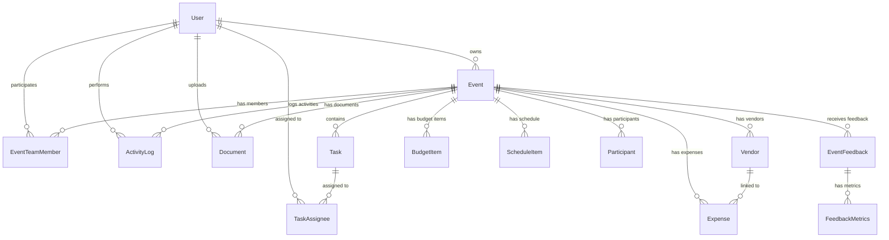

# DOMAIN_MODEL.md — Symera

## Entidades Principais

## Agregados

### Agregado: Event (Raiz)
O **Event** é o agregado raiz do sistema. Todas as entidades de negócio existem dentro do contexto de um evento.

| Entidade | Relacionamento | Descrição |
|----------|---------------|-----------|
| `Event` | Raiz | O evento em si |
| `Task` | Filho | Tarefas do evento |
| `TaskAssignee` | Neto (via Task) | Responsáveis por cada tarefa |
| `EventTeamMember` | Filho | Membros da equipe do evento |
| `Vendor` | Filho | Fornecedores contratados |
| `BudgetItem` | Filho | Itens planejados do orçamento |
| `Expense` | Filho | Despesas reais |
| `ScheduleItem` | Filho | Itens do cronograma |
| `Document` | Filho | Documentos anexados |
| `Participant` | Filho | Participantes/convidados |
| `EventFeedback` | Filho | Feedbacks recebidos |
| `FeedbackMetrics` | Neto (via Feedback) | Métricas de cada feedback |
| `ActivityLog` | Filho | Registro de atividades |

### Agregado: User
| Entidade | Descrição |
|----------|-----------|
| `User` | Representa um usuário do sistema |

O `User` é independente e referenciado por praticamente todas as entidades via `ownerId`, `userId`, `assigneeId`, `uploadedById`.

## Value Objects

| Value Object | Usado em | Descrição |
|-------------|----------|-----------|
| `EventStatus` | `Event.status` | `planning`, `confirmed`, `in_progress`, `completed`, `cancelled` |
| `TaskStatus` | `Task.status` | `todo`, `in_progress`, `completed` |
| `TaskPriority` | `Task.priority` | `low`, `medium`, `high` |
| `EventFormat` | `Event.format` | Formato do evento (presencial, online, híbrido) |
| `EventType` | `Event.type` | Tipo do evento (casamento, corporativo, etc.) |
| `ParticipantStatus` | `Participant.status` | `pending`, `confirmed`, `cancelled` |
| `ParticipantOrigin` | `Participant.origin` | `manual`, `import` |
| `TeamMemberRole` | `EventTeamMember.role` | `organizer`, ou roles customizados |
| `Permissions` | `EventTeamMember.permissions` | JSON: `{canDelete, canEdit, canInvite}` |
| `MonetaryAmount` | `BudgetItem.amount`, `Expense.amount`, `Vendor.cost` | Inteiro representando centavos |

## Eventos de Domínio

Embora o sistema não implemente event sourcing, as ações são registradas na tabela `activity_logs`:

| Evento | Action | Detalhes |
|--------|--------|----------|
| Evento criado | `created_event` | `{eventName}` |
| Evento atualizado | `updated_event` | `{eventName}` |
| Status alterado | `status_updated` | `{eventName, oldStatus, newStatus}` |
| Tarefa criada | `created_task` | `{taskTitle}` |
| Tarefa atualizada | `updated_task` | `{taskTitle}` |
| Membro adicionado | `added_team_member` | `{memberName, role}` |
| Membro removido | `removed_team_member` | `{memberName}` |
| Fornecedor adicionado | `added_vendor` | `{vendorName}` |
| Documento enviado | `uploaded_document` | `{documentName}` |

## Linguagem Ubíqua

| Termo (pt-BR) | Termo técnico | Definição |
|--------------|---------------|-----------|
| **Evento** | `Event` | Uma ocasião planejada com data, local e propósito definidos |
| **Tarefa** | `Task` | Uma atividade a ser realizada para a execução do evento |
| **Checklist** | `Task[]` (com IA) | Conjunto de tarefas geradas automaticamente para o evento |
| **Responsável** | `TaskAssignee` | Pessoa designada para executar uma tarefa |
| **Equipe** | `EventTeamMember[]` | Grupo de pessoas com acesso e responsabilidades no evento |
| **Organizador** | `organizer` (role) | Criador/líder do evento com todas as permissões |
| **Fornecedor** | `Vendor` | Empresa ou profissional contratado para serviço no evento |
| **Orçamento** | `BudgetItem[]` | Conjunto de itens planejados para o evento |
| **Despesa** | `Expense` | Gasto real efetivado para o evento |
| **Cronograma** | `ScheduleItem[]` | Sequência de atividades programadas para o dia do evento |
| **Participante** | `Participant` | Convidado ou público do evento |
| **Feedback** | `EventFeedback` | Avaliação pós-evento por participantes |
| **Rascunho** | Draft Event | Evento em processo de criação, salvo automaticamente |
| **Proprietário** | `ownerId` | Usuário que criou o evento e tem controle total |
| **Log de atividade** | `ActivityLog` | Registro histórico de ações realizadas no evento |

---

*Última atualização: 12/02/2026*
