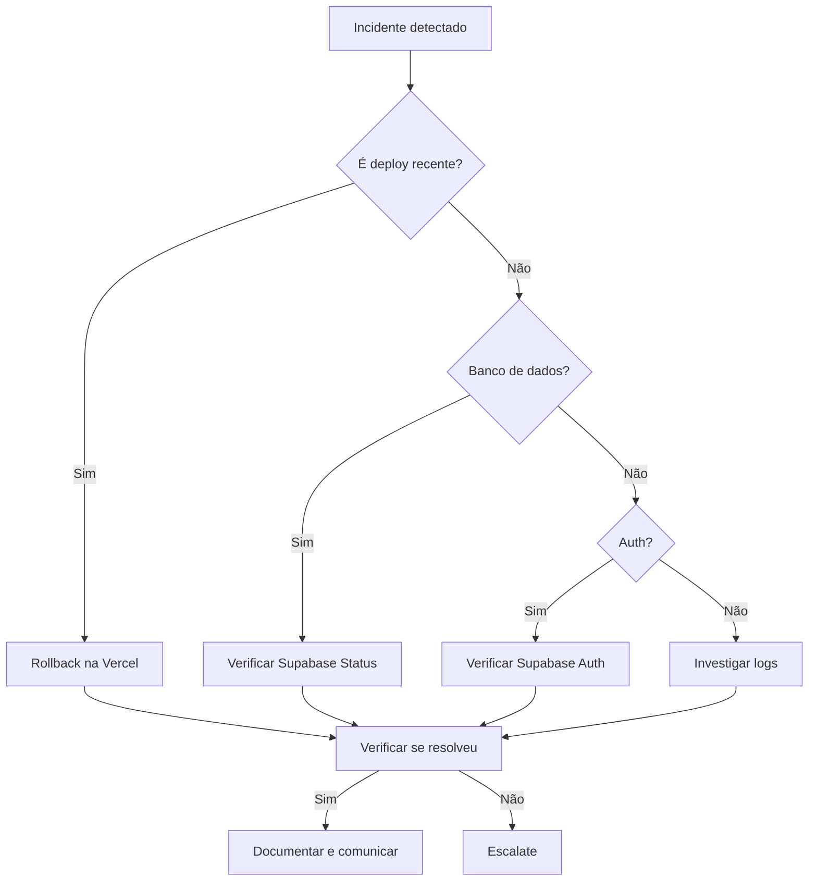

# INCIDENT_RESPONSE.md — Symera

## Classificação de Incidentes

| Severidade | Critério | Tempo de Resposta | Exemplos |
|-----------|---------|-------------------|----------|
| 🔴 **P0 — Crítico** | Sistema indisponível ou dados corrompidos | < 15 min | Banco de dados fora do ar, produção caiu, perda de dados |
| 🟠 **P1 — Alto** | Funcionalidade core quebrada | < 1 hora | Login não funciona, eventos não carregam, 5xx generalizado |
| 🟡 **P2 — Médio** | Feature secundária quebrada | < 4 horas | Upload de documentos falha, checklist IA não gera, feedback não submete |
| 🟢 **P3 — Baixo** | Bug cosmético ou edge case | < 24 horas | Layout quebrado em dispositivo específico, erro em export |

## Procedimento de Contenção

### P0 — Sistema Indisponível



### Passos Imediatos
1. **Confirmar o incidente**: Verificar se o problema é reproduzível.
2. **Comunicar**: Notificar stakeholders sobre o incidente.
3. **Identificar causa raiz**: Verificar logs, último deploy, status de serviços externos.
4. **Conter**: Rollback se causado por deploy recente.
5. **Mitigar**: Aplicar hotfix ou workaround temporário.
6. **Resolver**: Implementar fix definitivo.
7. **Post-mortem**: Documentar o que aconteceu.

### Comandos de Diagnóstico Rápido

| Verificação | Comando/Ação |
|-------------|-------------|
| **Status Vercel** | Dashboard Vercel → Deployments → verificar último deploy |
| **Status Supabase** | [status.supabase.com](https://status.supabase.com) |
| **Logs do servidor** | Vercel Dashboard → Logs |
| **Conexão com banco** | `GET /api/debug/check-events` (em dev) |
| **Estado da auth** | `GET /api/auth/dev-available` |
| **Rollback** | Vercel Dashboard → Deployments → Promote deploy anterior |

## Comunicação

### Canais
| Canal | Uso |
|-------|-----|
| **WhatsApp / Telegram** | Comunicação imediata (P0, P1) |
| **Email** | Comunicação formal e post-mortems |
| **GitHub Issues** | Rastreamento de bugs e follow-up |

### Template de Comunicação de Incidente
```
🚨 INCIDENTE [P0/P1/P2/P3]

Horário de início: [HH:MM BRT]
Impacto: [Descrição do impacto para o usuário]
Status: [Investigando / Mitigando / Resolvido]
Causa: [Causa raiz se conhecida]
Ação: [O que está sendo feito]
ETA para resolução: [Estimativa]
```

## Post-Mortem Padrão

### Template

```markdown
# Post-Mortem: [Título do Incidente]

## Resumo
- **Data**: DD/MM/AAAA
- **Duração**: X minutos/horas
- **Severidade**: P0/P1/P2/P3
- **Impacto**: Descrição do impacto nos usuários

## Timeline (UTC-3)
| Horário | Evento |
|---------|--------|
| HH:MM | Incidente detectado |
| HH:MM | Início da investigação |
| HH:MM | Causa raiz identificada |
| HH:MM | Mitigação aplicada |
| HH:MM | Incidente resolvido |

## Causa Raiz
[Descrição detalhada da causa raiz]

## O Que Deu Errado
[Lista de fatores que contribuíram]

## O Que Deu Certo
[Lista de coisas que funcionaram bem na resposta]

## Ações Corretivas
| Ação | Responsável | Prazo | Status |
|------|-------------|-------|--------|
| [Ação 1] | [Nome] | [Data] | [ ] |
| [Ação 2] | [Nome] | [Data] | [ ] |

## Lições Aprendidas
[O que aprendemos com este incidente]
```

### Princípios do Post-Mortem
1. **Sem culpar pessoas** — focar em sistemas e processos.
2. **Fatos, não suposições** — basear-se em logs e evidências.
3. **Ações concretas** — cada lição deve ter uma ação associada.
4. **Compartilhar** — post-mortems devem ser acessíveis a todo o time.

---

*Última atualização: 12/02/2026*
