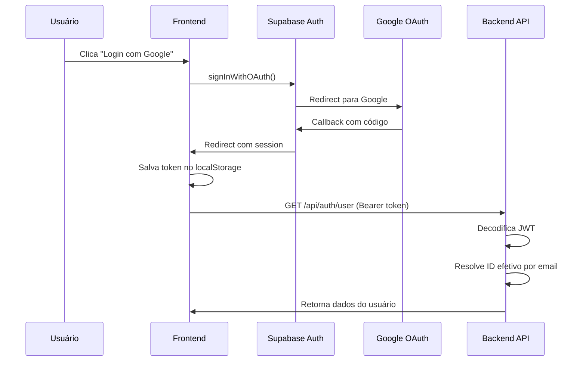

# SECURITY.md — Symera

## Modelo de Autenticação

### Supabase Auth (Produção)
- **Provider**: Google OAuth 2.0 via Supabase.
- **Fluxo**: OAuth2 Authorization Code Flow.
- **Token**: JWT assinado pelo Supabase, enviado como `Authorization: Bearer <token>`.
- **Persistência**: Token e dados de auth salvos no `localStorage` com TTL de 30 dias.
- **Refresh**: Frontend tenta renovar token automaticamente via `supabase.auth.refreshSession()`.

### Dev Token (Desenvolvimento)
- Disponível apenas quando `NODE_ENV !== 'production'`.
- Token com prefixo `dev-token-` contendo payload base64.
- ID fixo do usuário de teste: `8650891`.
- **Rejeitado automaticamente** em produção (HTTP 403).

### Fluxo de Autenticação


## Modelo de Autorização

### Owner-Based Access Control
O sistema usa um modelo baseado em **proprietário** com extensão por equipe:

| Ação | Owner | Team Member | Público |
|------|-------|-------------|---------|
| Visualizar evento | ✅ | ✅ | ❌ |
| Editar evento (PUT) | ✅ | ❌ | ❌ |
| Alterar status (PATCH) | ✅ | ✅ | ❌ |
| Deletar evento | ✅ | ❌ | ❌ |
| Gerenciar tarefas | ✅ | ✅ (se acesso) | ❌ |
| Enviar feedback | ❌ | ❌ | ✅ |

### Verificação de Acesso
```typescript
// Verificação em cada rota protegida:
const isOwner = event.ownerId === userId;
const isTeamMember = await dbStorage.isUserTeamMember(userId, eventId);
```

## Gestão de Permissões

### Permissões de Equipe
Armazenadas como JSON string na coluna `permissions` da tabela `event_team_members`:
```json
{
  "canDelete": true,
  "canEdit": true,
  "canInvite": true
}
```

> **Nota**: As permissões estão definidas no schema, mas a enforcement granular (verificar `canEdit` antes de permitir PUT em tasks, por exemplo) **não está totalmente implementada** em todas as rotas. Atualmente, a verificação principal é `isOwner || isTeamMember`.

## Proteção Contra Ataques Comuns

### Implementado ✅

| Ataque | Proteção |
|--------|----------|
| **Injection (SQL)** | Drizzle ORM parametriza todas as queries automaticamente |
| **XSS** | React escapa output por padrão; Radix UI sanitiza inputs |
| **CSRF** | API stateless com Bearer tokens (não depende de cookies para auth) |
| **Path Traversal (uploads)** | Multer gera filenames seguros com timestamp + sanitização |
| **Oversized Payloads** | `express.json({ limit: '50mb' })` + multer file size limits |
| **File Type Validation** | Whitelist de extensões permitidas no multer |
| **Dev Token em Produção** | Token de desenvolvimento rejeitado com verificação `NODE_ENV` |
| **JWT Expiração** | Verificação de `exp` claim antes de processar request |

### Não Implementado / Vulnerabilidades Conhecidas ⚠️

| Risco | Descrição | Severidade |
|-------|-----------|-----------|
| **JWT sem verificação de assinatura** | O backend decodifica o JWT mas **não verifica a assinatura** com a chave pública do Supabase | 🔴 Alta |
| **Rate limiting** | Não há rate limiting nas rotas da API | 🟡 Média |
| **CORS** | Não há configuração CORS explícita (herda defaults do Express) | 🟡 Média |
| **Helmet/Security headers** | Não usa `helmet` ou headers de segurança | 🟡 Média |
| **Cookies httpOnly: false** | Session cookie não é httpOnly | 🟡 Média |
| **Cookies secure: false** | Session cookie não tem flag `secure` | 🟡 Média |
| **Supabase config pública** | Endpoint `/api/supabase-config` expõe URL e anon key (elas são públicas por design) | 🟢 Baixa |
| **Logs com dados sensíveis** | Console.logs incluem user IDs e emails | 🟡 Média |
| **Uploads no filesystem** | Arquivos no filesystem local; na Vercel, são efêmeros | 🟡 Média |

## Estratégia de Auditoria

### Activity Logs
O sistema registra ações críticas na tabela `activity_logs`:
- Cada log inclui: `eventId`, `userId`, `action`, `details` (JSON), `createdAt`.
- Ações registradas: criação/edição de eventos, alteração de status, adição/remoção de membros.

### Request Logging
- Middleware intercepta todas as requisições `/api/*`.
- Log inclui: método HTTP, path, status code, duração em ms, response body truncado.

### Lacunas ⚠️
- Não há log de **quem** acessou dados sensíveis (apenas de quem modificou).
- Não há log de tentativas de acesso **negadas** (401/403).
- Logs são apenas `console.log` — não persistem além do runtime do servidor.

## Política de Dados Sensíveis

### Dados Sensíveis no Sistema
| Dado | Armazenamento | Proteção |
|------|--------------|----------|
| Email do usuário | PostgreSQL (texto claro) | Autenticação obrigatória para acesso |
| Telefone | PostgreSQL (texto claro) | Autenticação obrigatória |
| Foto de perfil | URL do Google/Supabase | URL pública |
| JWT tokens | localStorage (frontend) | TTL de 30 dias, limpeza no logout |
| SESSION_SECRET | `.env` (variável de ambiente) | Não commitado no repositório |
| DATABASE_URL | `.env` (variável de ambiente) | Não commitado no repositório |
| OPENAI_API_KEY | `.env` (variável de ambiente) | Não commitado no repositório |
| IP address | `feedback_metrics` | Coletado apenas em feedbacks públicos |

### .gitignore
O `.env` está incluído no `.gitignore` para evitar exposição de secrets.

### Recomendações para Produção
1. **Habilitar verificação de assinatura JWT** usando o JWT secret do Supabase.
2. **Adicionar Rate Limiting** (ex: `express-rate-limit`).
3. **Adicionar Helmet** para headers de segurança.
4. **Configurar CORS** explicitamente.
5. **Tornar cookies httpOnly e secure** em produção.
6. **Implementar log de acesso negado** (401/403).
7. **Migrar uploads** para Supabase Storage (URLs assinadas e temporárias).
8. **Sanitizar logs** para não incluir dados pessoais em produção.

---

*Última atualização: 12/02/2026*
